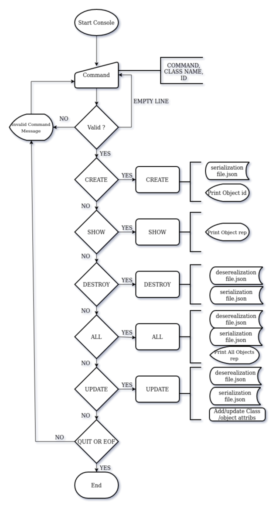

# AirBnB clone - The console

Console to manage objects and data storage. Developed in Python 3 for Holberton School by cohort10 students.

## Getting Started

To download this project and use it on your local machine, just follow the next instructions.

### Prerequisites

What things you need to use application

```
Ubuntu 14.04 LTS
Python 3
```

### Installing

No installation is needed, program es ready to execute.

## Running

To execute program call **./console.py** file. Type any AirBnB command to use it. Any change of data is storage in a json file.

#### Interactive mode

```
$ ./console.py
(hbtn )
```

#### No interactive mode

```
$ echo *<command>* | ./console.py
(hbnb) ....
```

Here *command* is any AirBnB console command

#### To execute test cases

Use Python3 Unittest in main directory

```
$ python3 -m unittest discover tests
```
## Flowchart


## Commands

### 0. help

Allows to see more information about commands (Built-in of Cmd Module in Python).

**Use:**
```
(hbtn) help
```

**Example:**
```
(hbnb) help

Documented commands (type help <topic>):
========================================
EOF  all  create  destroy  help  quit  show  update
```

### 1. quit

Exit the program. This could be done by use EOF (CTRL + D), too.

**Use:**
```
(hbtn) quit
```

### 3. create

Creates a new instance of a Class and prints id. And update in json file.

**Use:**
```
(hbtn) create <classname>
```

**Example:**
```
(hbtn) create BaseModel
4606c9f9-d23b-4327-9597-7668a769a872
```

### 4. show

Prints the string representation of an instance based on the class name and id.

**Use:**
```
(hbtn) create <classname> <id>
```

**Example:**
```
(hbtn) show BaseModel 4606c9f9-d23b-4327-9597-7668a769a872
[BaseModel] (4606c9f9-d23b-4327-9597-7668a769a872) {'id': '4606c9f9-d23b-4327-9597-7668a769a872', 'created_at': datetime.datetime(2020, 2, 18, 17, 0, 0, 141314), 'updated_at': datetime.datetime(2020, 2, 18, 17, 0, 0, 141364)}
```

### 5. destroy

Deletes an instance based on the class name and id. Update de json file.

**Use:**
```
(hbtn) destroy <classname> <id>
```

**Example:**
```
(hbtn) destroy BaseModel 4606c9f9-d23b-4327-9597-7668a769a872
(hbtn) 
```

### 6. all

Prints all string representation of all instances based or not on the class name.

**Use:**
```
(hbtn) all <classname>
```

**Example:**
```
(hbnb) all
["[User] (ba03ef87-ceb3-45fd-b5d4-123f6c584870) {'id': 'ba03ef87-ceb3-45fd-b5d4-123f6c584870', 'created_at': datetime.datetime(2020, 2, 18, 17, 16, 59, 906237), 'updated_at': datetime.datetime(2020, 2, 18, 17, 16, 59, 906277)}", "[BaseModel] (dfc9f41b-fefc-4b2b-b3df-0c0372343cca) {'id': 'dfc9f41b-fefc-4b2b-b3df-0c0372343cca', 'created_at': datetime.datetime(2020, 2, 18, 17, 17, 41, 591396), 'updated_at': datetime.datetime(2020, 2, 18, 17, 17, 41, 591434)}", "[City] (478bda10-e48c-4090-bfaa-7c181fd54e3b) {'id': '478bda10-e48c-4090-bfaa-7c181fd54e3b', 'created_at': datetime.datetime(2020, 2, 18, 17, 18, 17, 565443), 'updated_at': datetime.datetime(2020, 2, 18, 17, 18, 17, 565481)}"]
```
To see all instances in a specific Class
```
(hbnb) all City
["[City] (478bda10-e48c-4090-bfaa-7c181fd54e3b) {'id': '478bda10-e48c-4090-bfaa-7c181fd54e3b', 'created_at': datetime.datetime(2020, 2, 18, 17, 18, 17, 565443), 'updated_at': datetime.datetime(2020, 2, 18, 17, 18, 17, 565481)}"]
```

### 7. update

Updates an instance based on the class name and id by adding or updating attribute. Update the json file.

**Use:**
```
(hbtn) update <class name> <id> <attribute name> "<attribute value>"
```

**Example:**
```
(hbnb) update City 478bda10-e48c-4090-bfaa-7c181fd54e3b name "Cali"
```

## Class Included

The program have this Class and Public attributes that can be used by console.

### BaseModel

* id: unique id created by _uuid_. This is made by the program.
* created_at: creation date. This is made by the program, and write date when a new instance is created.
* updated_at: update date. This is made by the program, and write the date by data change.

### User
Inherits from BaseModel Class.

* email: string.
* password: string.
* first_name: string.
* last_name: string.

### State
Inherits from BaseModel Class.

* name: string.

### City
Inherits from BaseModel Class.

* state_id: string.
* name: string.

### Amenity
Inherits from BaseModel Class.

* name: string.

### Place
Inherits from BaseModel Class.

* city_id: string.
* user_id: string.
* name: string.
* description: string.
* number_rooms: integer.
* number_bathrooms: integer.
* max_guest: integer.
* price_by_night: integer.
* latitude: float.
* longitude: float.
* amenity_ids: list of string.

### Review
Inherits from BaseModel Class.

* place_id: string.
* user_id: string.
* text: string.

## Authors

* **Ivan Dario Lasso Gil** - *Holberton Student. Cohort 10* - [Email](mailto:ivan-dario.lasso-gil@holbertonschool.com)
* **Stuart Echeverry Solarte** - *Holberton Student. Cohort 10* - [Email](mailto:stuart.echeverry@holbertonschool.com)

See also the list of [AUTHORS](https://github.com/stuartses/AirBnB_clone/blob/master/AUTHORS) who participated in this project.

## Date
This project was uploaded on: Feb 18, 2020
